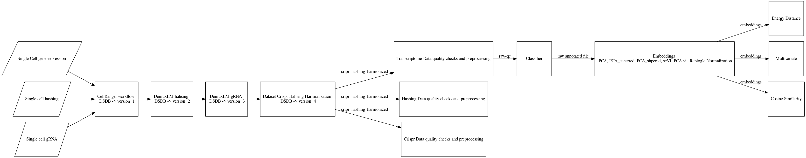

# Perturb-seq Pipeline

## An End-to-End Analytical Pipeline for Large Perturb-seq (or Crop-seq) Screens

This pipeline provides a comprehensive approach to analyze large-scale Perturb-seq or Crop-seq screens, supporting critical tasks from alignment to identifying significant perturbations.

---

## Key Analysis Stages

1. **Alignment**  
   Align raw sequencing reads to a reference genome to ensure that the data is mapped correctly for downstream analysis.

2. **HTO Demultiplexing**  
   Process the Hashing-Tag-Oligonucleotide (HTO) barcodes to separate samples in the multiplexed data, ensuring proper sample identification.

3. **CRISPR Demultiplexing**  
   Separate and assign CRISPR guide RNA sequences to their corresponding cells, facilitating the identification of specific perturbations used in the experiment.

4. **Quality Control (QC)**  
   Perform quality checks on the demultiplexed data to assess its integrity, remove low-quality reads, and ensure readiness for analysis.

5. **Cell Type Classification**  
   Classify cells into predefined categories based on expression patterns, allowing for targeted analysis of specific cell types.

6. **Embeddings**  
   Use dimensionality reduction techniques like PCA or UMAP to embed high-dimensional data into lower-dimensional space for visualization.

7. **Data Integration and Batch Effect Correction using scVI**  
   Integrate data from multiple sources or batches while correcting for batch effects using **scVI** (single-cell Variational Inference), a deep learning-based approach. This helps in normalizing data across different experimental conditions and ensures that variations due to batch differences are minimized, improving downstream analysis.

8. **Feature Selection using Binomial Deviance Genes**  
   Select the most relevant features using statistical methods like binomial deviance to highlight significant genes for further analysis. We employed the top 3000 binomial deviance genes. This method focuses on genes that deviate most from a binomial distribution, capturing rare and highly informative features within the dataset.

9. **Beta Coefficient Calculation**  
   Compute beta coefficients to measure the effect of each gene or feature on the variable of interest in the analysis.

10. **Identifying Significant Perturbations using Energy Distance and Cosine Similarity**  
   Analyze the differences between perturbations in the data by calculating energy distance and cosine similarity. **Energy distance** measures the statistical difference between distributions, while **cosine similarity** quantifies the angular similarity between vectors, often used for comparing gene expression profiles between different conditions or perturbations. This combined approach helps to identify and validate significant effects on cellular function.

11. **Perturbation Efficiency Calculation**  
   Calculate the efficiency of each perturbation, evaluating how well each treatment or intervention influences cellular outcomes.

These stages enable comprehensive analysis of genetic perturbations in single-cell data, providing insights into cell type-specific responses and functional genomics.




## Usage

**Section 1: Running Cumulus Analysis**

**Step 1: Setting Up Initial Data**

- Open the `split_maker` Python notebook to initialize the pipeline.
 
  **Inputs:**
  - Insert SAMID (Sample Identifier) and experiment name from HITSLIMS.
  - Download and transfer fast path and library list files from HITSLIMS to the designated 'data' folder.
  - Copy hashing index information to the data folder.
  - Obtain CRISPR index information from Genomitory using sub-library details.


**Step 2: Preparing Sample Sheets and Job Submission Files**

- Generate sample sheets and create job submission files for CellRanger.

**Step 3: Monitoring CellRanger Progress**

- Await completion of CellRanger processing and retrieve the DSDBid from the notebook.

**Step 4: Hashing and CRISPR Demultiplexing**

- Create sample sheets for hashing and CRISPR demuxed files and initiate hashing and CRISPR demuxem jobs.

**Section 2: Running the Crop-Seq Pipeline**

**Step 5: Configuring Main Pipeline Parameters**

- Access the main file located at `crop-see-pipeline/src/main` to input DSDBid and assign necessary parameters.

**Step 6: Environment Configuration**

- Switch the pipeline environment to 'DEV/GPuy310' for optimized processing.

**Step 7: Quality Control (QC) Reporting**

- Execute notebooks to generate QC reports for each split data set.

**Step 8: Data Integration**

- Concatenate individual splits into a unified AnnData structure for comprehensive analysis.

**Step 9: Analysis and Evaluation**

- Apply classifier, Norm_control, embedding, and energy distance algorithms for in-depth analysis.

**Step 10: Data Storage and Output**

- Store all results within an AnnData object, with embedding and energy distance p-values exported as CSV files to the respective folder.

Follow these comprehensive steps to effectively run the Crop-Seq pipeline and analyze your data. Adjustments and environment modifications can be made as necessary to suit specific requirements and data configurations.


## Installation
Clone the repository and install the required dependencies:
```bash
git clone https://github.com/Siavashghaffari/Perturb-seq-Pipeline
cd Perturb-seq-Pipeline
pip install -r requirements.txt
```


## AnnData Schema

**Overview of adata.obs:**
`adata.obs` is a DataFrame containing several columns:
- **Sample:** Represents the pool sample ID.<br>
- **Barcode:** Denotes the unique cell barcode.
- **DemuxType_crispr:** Indicates sinlget, doublets or unknown from CRISPR data.
- **DemuxAssignment_crispr:** Assigns the demultiplexed CRISPR sample IDs to different gRNAs.
- **DemuxType_hashing:**  Indicates sinlget, doublets or unknown from hashing data.
- **DemuxAssignment_hashing:** Assigns the demultiplexed hashing sample IDs to different biological batches.
- **cellline:** Represents the cell line information.
- **timepoint:** Denotes the timepoint of the experiment.
- **HTO:** Contains the hashing information.
- **NGS_ID:** Represents the NGS experiment ID.
- **Biological_replicate:** Provides information about biological replicates.
- **10Xrun:** Indicates the information related to 10x runs.
- **sublibrary:** Specifies the sublibrary information.
- **gRNA_library_MOI:** Represents information about gRNA library and MOI (Multiplicity of Infection).
- **gene_symbol:** Denotes the gene symbol associated with the cell.
- **Class:** Represents the class assigned to the cell.
- **SCN_class:** Indicates the class assigned by singleCellNet.
- **qc_pass:** A boolean value indicating whether the data passes the quality checks.
- **gem:** Created from NGS_ID and 10X run, providing additional information.

**Embeddings in adata.obsm:**

`adata.obsm` contains embeddings with 6 different keys:

- **'X_pca'**
- **'X_pca_centered'**
- **'X_pca_sphered'**
- **'X_pca_sphered_Norm'**
- **'X_scVI'**
- **'X_scVI_centered'**
- **'X_umap'**

Additionally, embeddings are available in the 'embeddings' folder as CSV files.

**Energy Distance Results:**

Energy distance results are stored in `adata.uns["energy_distance"]` as a dictionary for different embedding keys.

This comprehensive overview provides insights into the structure and contents of `adata.obs`, `adata.obsm`, and `adata.uns["energy_distance"]`. Each column and key serves a specific purpose in the analysis of single-cell data. Adjustments and further analysis can be performed based on these data components. The availability of embeddings in the 'embeddings' folder provides additional accessibility for downstream analysis.


## Authors and acknowledgment
This work was developed by Siavash Ghaffari. For any questions, feedback, or additional information, please feel free to reach out. Your input is highly valued and will help improve and refine this pipeline further.

